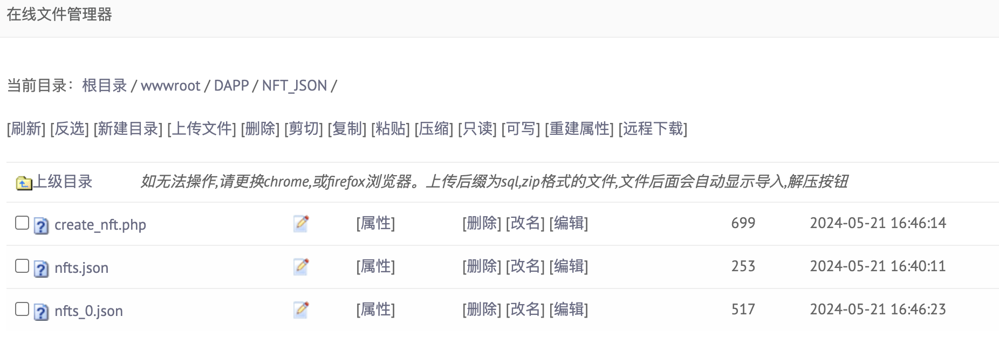
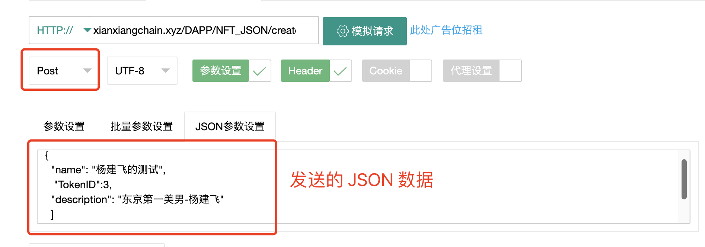
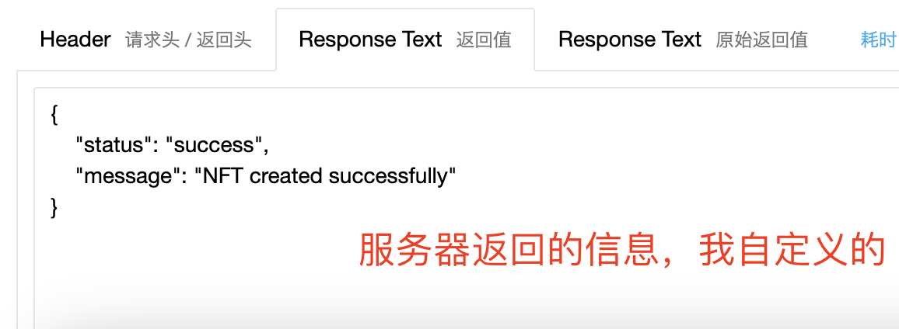
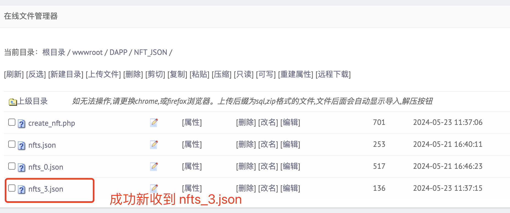
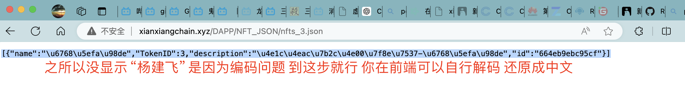

# -DAPP

**背景**：在区块链网络上铸造 NFT 时，需要传入多个参数。其中一个是 Token 的 URI 信息。
这个本质上是一个链接，链接指向一个 JSON 数据，这里面可以详细定义NFT的具体信息：商品名称、产地、供应商、发货时间等等信息。这些信息如果存储在区块链上会很臃肿 并且时常需要更新。因此往往存储在中心化服务器上。

**任务**：总之，现在需要设计一个前端来管理NFT 的 URI 信息，也就是说管理 JSON 数据。
看个例子：这个链接指向我最近制备的一个 json 数据，存在了我的域名下的服务器上。

`http://xianxiangchain.xyz/DAPP/NFT_JSON/nfts_0.json`

里面的信息虽然是我编的，但是先看看：

```
[{"name":"My First NFT","description":"This is a description of my first NFT","image":"http://example.com/images/my-first-nft.png","attributes":[{"trait_type":"Background","value":"Blue"},{"trait_type":"Eyes","value":"Green"}],"id":"664c5debe754b"}]

```

这是通过接口实现的，向这个链接发送post请求，内容是 JSON数据，同时要确保有键值对：{'TokenID'：X} X为ID值 整数 这个接口就会在服务器同目录下创建一个文件名称为 nfts_X.json X为整数。
`http://xianxiangchain.xyz/DAPP/NFT_JSON/create_nfts.php`
创建完成后就可以根据 `http://xianxiangchain.xyz/DAPP/NFT_JSON/nfts_X.json`访问到URI数据。

你的任务就是制作一个前端页面，能够查看目前的 JSON 数据是什么，最好通过表单显示出来。然后可以进行修改，修改完，点击按钮、确认发送到之前的接口`http://xianxiangchain.xyz/DAPP/NFT_JSON/create_nfts.php` 会自动更新。

可视化例子：工具是在线post网站

这是服务器页面可以看到脚本create_nfts.php和被创建出的json文件。
使用工具，在你的情况里用js实现，发送post请求，尝试创建一个X=3的 nfts_3.json.  
  

注意这里一定要有 {"TokenID"：3} 这个键值对，不然会报错，因为我是靠这个属性决定文件命名。
  
可以看到成果发送了，并且已经新收到了,咱们浅浅访问下新的文件通过链接`http://xianxiangchain.xyz/DAPP/NFT_JSON/nfts_3.json`  
  

到这里为止，你应该了解了。设计一个前端网页来查看、管理、编辑、更新json数据，这很类似于我们DAPP的后台。  
至于这些 JSON 数据的字段你可以自己编一下，不少于 5 个。